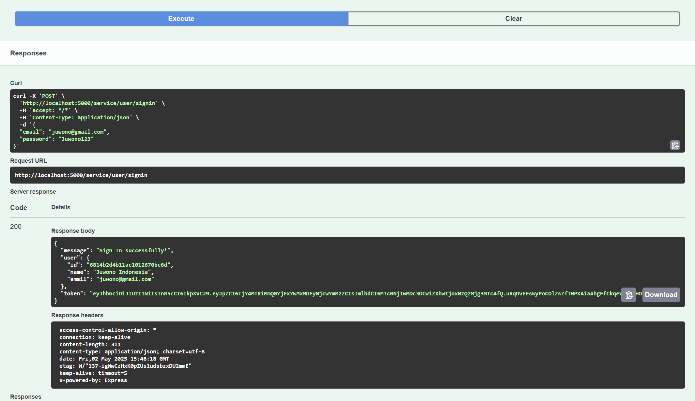

This is the testing for adding to the to do list. 

This is the testing for updating the to do list. 

This is the testing for deleting the to do list. 

This is the testing for getting the to do list. 

This is the testing for adding a user and require log in because of the middleware.

This is the testing for updating a user and require log in because of the middleware. (Need to put user ID)

This is the testing for deleting a user and require log in because of the middleware. (Need to put user ID)

This is the testing for getting a user info and require log in because of the middleware.

This is the testing for signing up new user.

This is the testing for signin in a user. 
